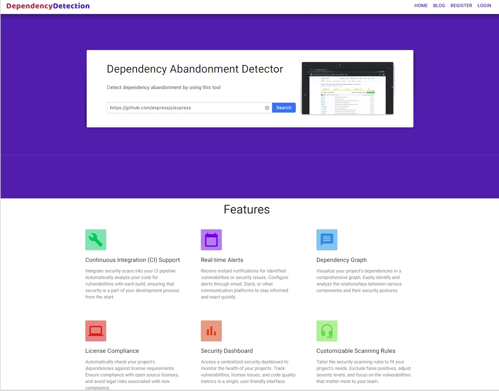
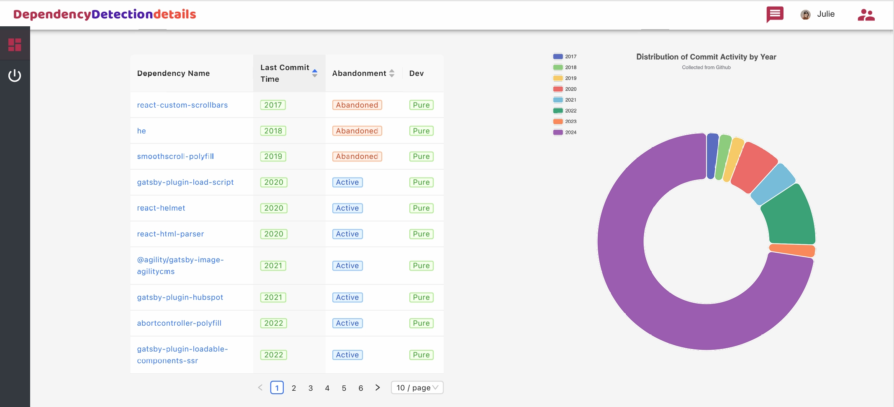
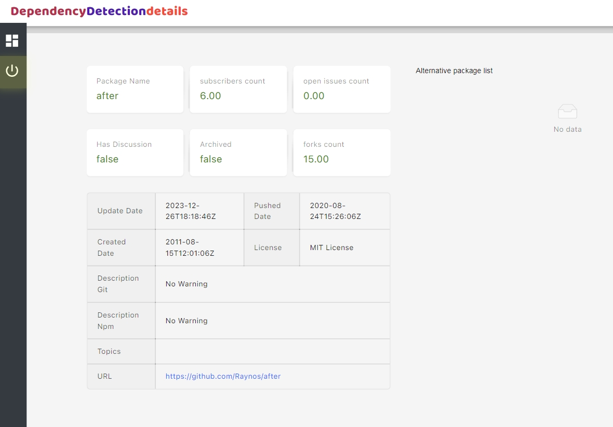

# Appendix

## The Abandabot Prototype in the Need-Finding Interview

The Abandabot prototype is implemented as a web application (see the following screenshot):

For a JavaScript project, it provides a list of all the project's dependencies, the date of the last commit, a flag for whether the dependency has been flagged as archived on GitHub, as well as the dependency type (normal, development, or peer). See the following screenshot:

We included the type of dependency because we hypothesized based on previous conversations with developers that some developers might care more about runtime dependencies or development dependencies depending on their use case, experience, and philosophical beliefs.

For each detection, we implemented a prototype page showing the abandonment details, as shown in the following screenshot:

## Aggregated Participant Agreement with Abandabot-Predict Judgements

There were 146 instances where the tool predicted Impactful, and participants agreed with 113/146 judgements. There were 157 instances where the tool predicted Not Impactful, participants agreeing with 142/157 judgements. 

|                      | **Predicted Judgement**      |                         |
|----------------------|------------------------------|-------------------------|
|                      | **Impactful**               | **Unimpactful**        |
|                      | (n=146)                      | (n=157)                 |
| **Participant Judgement**  |                        |                         |
| **Impactful**        | 113                          | 15                      |
| **Unimpactful**      | 33                           | 142                     |
